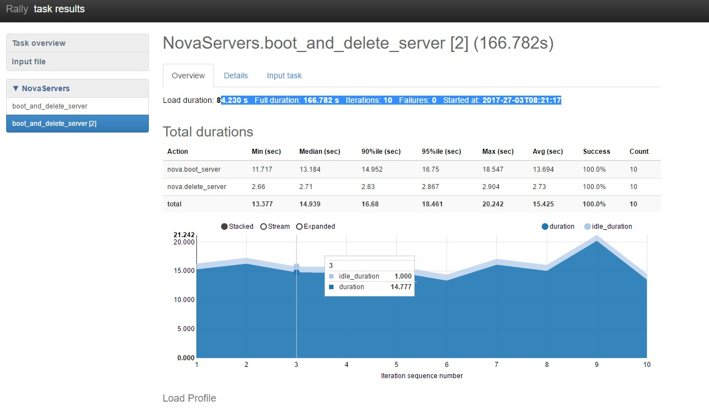

# Hướng dẫn cài đặt Rally
***

<a name="I."> </a> 
# I. Cài đặt cơ bản
***
<a name="1"> </a> 
## 1. Chuẩn bị môi trường
<a name="1.1"> </a> 
### 1.1 Mô hình mạng
- Mô hình đầy đủ


<a name="1.2"> </a> 
### 1.2 Các tham số phần cứng đối với các node


## 2. Cài đặt trên node Rally
Rally hỗ trợ 3 cách cài đặt:
 - Cài đặt từ source code
 - Cài đặt với Devstack
 - Cài đặt Rally với Docker

## 2.1. Cài đặt Rally từ source code

 - Cài đặt các công cụ:
 ```
 apt-get install  git python-pip -y
 ```

 - Cài đặt Rally thông qua script tự động:
 ```
 curl https://raw.githubusercontent.com/openstack/rally/master/install_rally.sh | bash
 ```

 Hoặc:

 ```
 git clone https://github.com/openstack/rally.git
 cd rally.git
 ./install_rally.sh
 #Nếu muốn cài rally trong thư mục chỉ định
 ./install_rally.sh --target /foo/bar
 ```

*Lưu ý: Nếu cài bằng user thường, Rally sẽ được cài trong một virtual env là ~/rally*

 - Cài đặt Rally DB:
 ```
 rally-manage db recreate
 ```

 - Tạo file `existing-keystone-v3.json` thông tin về hệ thống OpenStack sẽ kết nối tới, Rally hỗ trợ xác thực với Keystone v2 và v3, sau đây là định dạng file cấu hình sử dụng Keystone v3:
 ```
 {
    "type": "ExistingCloud",
    "auth_url": "https://10.10.10.120:5000/v3/",
    "region_name": "RegionOne",
    "endpoint_type": "public",
    "admin": {
        "username": "admin",
        "password": "Welcome123",
        "user_domain_name": "admin",
        "project_name": "admin",
        "project_domain_name": "admin"
    },
    # Nếu không sử dụng SSL cho Keystone API, set là false 
    "https_insecure": true,
    "https_cacert": ""
 }
 ```

 - Tạo 1 `deployment` cho hệ thống OpenStack được benchmark
 ```
 rally deployment create --file=existing-keystone-v3.json --name=OPS1
 
 +--------------------------------------+----------------------------+------+------------------+--------+
| uuid                                 | created_at                 | name | status           | active |
+--------------------------------------+----------------------------+------+------------------+--------+
| 30c79808-98b0-4db2-9a23-81a86e5bad01 | 2017-03-26 10:28:59.340035 | OPS1  | deploy->finished | *      |
+--------------------------------------+----------------------------+------+------------------+--------+
```
 - Kiểm tra việc kết nối:
 ```
 rally deployment check
 
 +-------------+----------+-----------+
| services    | type     | status    |
+-------------+----------+-----------+
| __unknown__ | alarming | Available |
| __unknown__ | volumev2 | Available |
| ceilometer  | metering | Available |
| cinder      | volume   | Available |
| glance      | image    | Available |
| keystone    | identity | Available |
| neutron     | network  | Available |
| nova        | compute  | Available |
+-------------+----------+-----------+
```

 - Có thể chuyển giữa các `deployment` bằng lệnh:
 ```
 rally deployment use OPS2
 ```
 `rally deployment -h` để xem thêm các tùy chọn

## 2.2. Benchmark OpenStack
 Rally có sẵn các kịch bản mẫu để benchmark đặt tại thư mục rally.git/samples/tasks/scenarios. Hướng dẫn sau sẽ thử nghiệm benchmark khả năng tạo và xóa máy ảo liên tục của OpenStack.

 - Copy file kịch bản từ thư mục gốc
 ```
 cp rally.git/samples/tasks/scenarios/nova/boot-and-delete.yaml /root
 ```

 - Chỉnh sửa file kịch bản:
 ```
 
  ---
  NovaServers.boot_and_delete_server: 
    -
    #Khai báo các tham số sử dụng trong kịch bản
      args:
        flavor:
            name: "m1.tiny"
        image:
            name: "cirros"
        auto_assign_nic: true
    #Khai báo loại tải cho kịch bản
      runner:
        type: "constant"
        #Tổng số lần thực hiện
        times: 10
        #Số lần thực hiện đồng thời
        concurrency: 2
    #Khai báo ngữ cảnh thực hiện bài test
      context:
        users:
          tenants: 3
          users_per_tenant: 2
        network:
          start_cidr: "10.2.0.0/24"
          networks_per_tenant: 2
    #Khai báo SLA cho bài test
      sla:
 ```
 Đối với `runner`, có thể sử dụng các kiểu:
  - `constant`: tạo tải bằng cách thực hiện kịch bản test một số lần nhất định, có khả năng chạy song song đa luồng(thông qua trường `concurreny`)
  - `constant_for_duration`: hoạt động giống `constant`, nhưng sẽ thực hiện test trong một khoảng thời gian nhất định(thông qua trường `duration`) 
  - `periodic`: thực hiện kịch bản với một khoảng nghĩ giữa 2 lần chạy liên tiếp(thông qua trường `period`)
  - `serial`: thực hiện test tuần tự qua một số lần nhất định, chạy đơn luồng
 Để chỉ định thời gian timeout cho từng lần chạy, thêm trường `timeout` vào `runner`.
 
 - Thực hiện bài test:
 ```
 rally task start boot-and-delete.yaml
 ```
 - Xuất kết quả sau khi test (sử dụng định dạng html):
 ```
 rally task report --out=report_rally.html
 ```

 - Mở file html bằng trình duyệt và nhận được kết quả đo:
 

Tham khảo:
[1] - https://wiki.openstack.org/wiki/Rally/Concepts
[1] - https://rally.readthedocs.io/en/latest/quick_start/tutorial/step_2_input_task_format.html